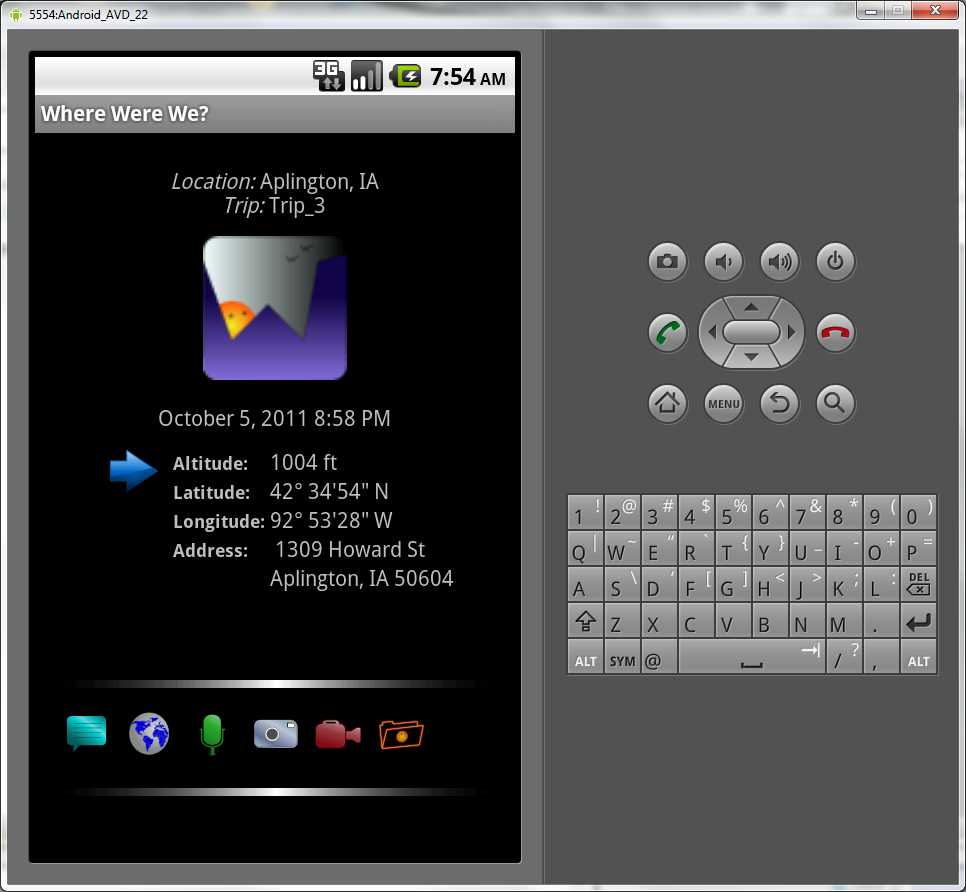
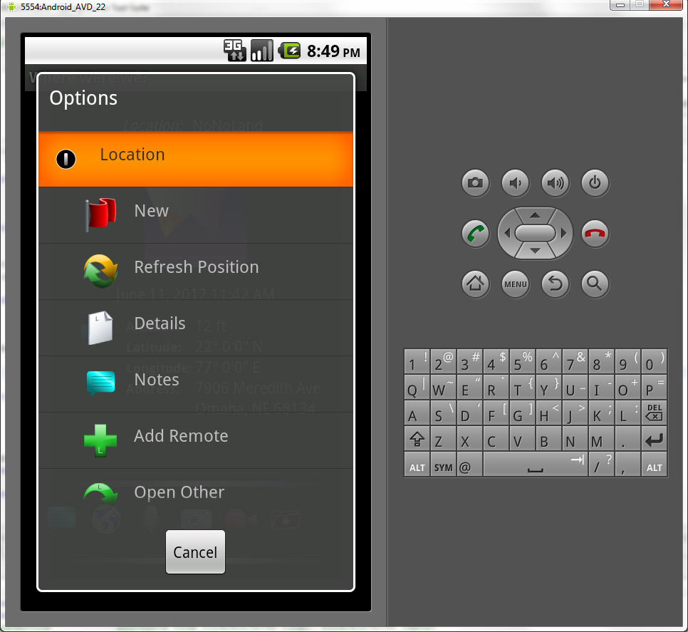
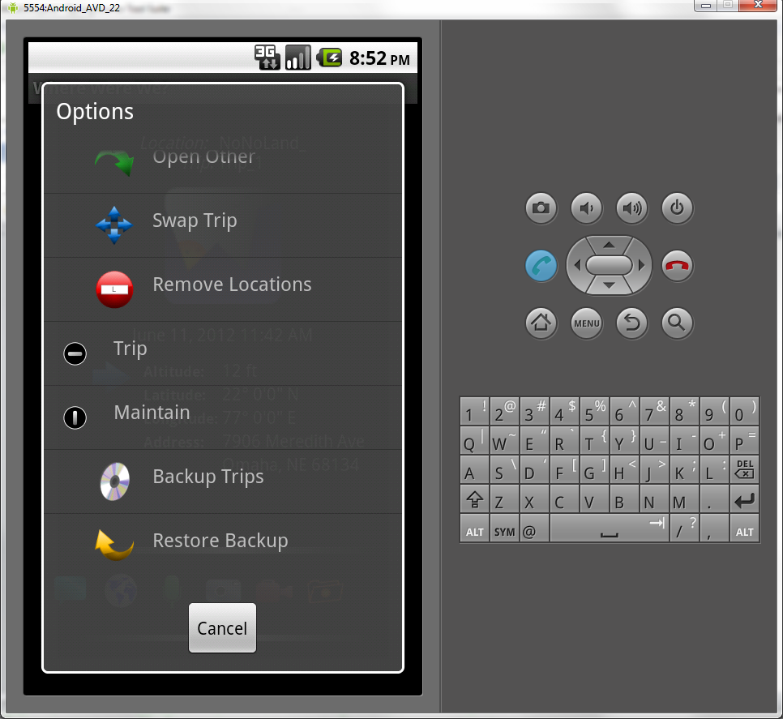
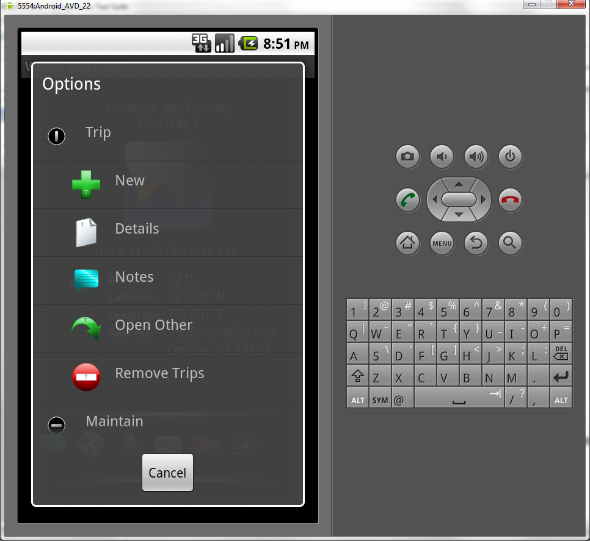
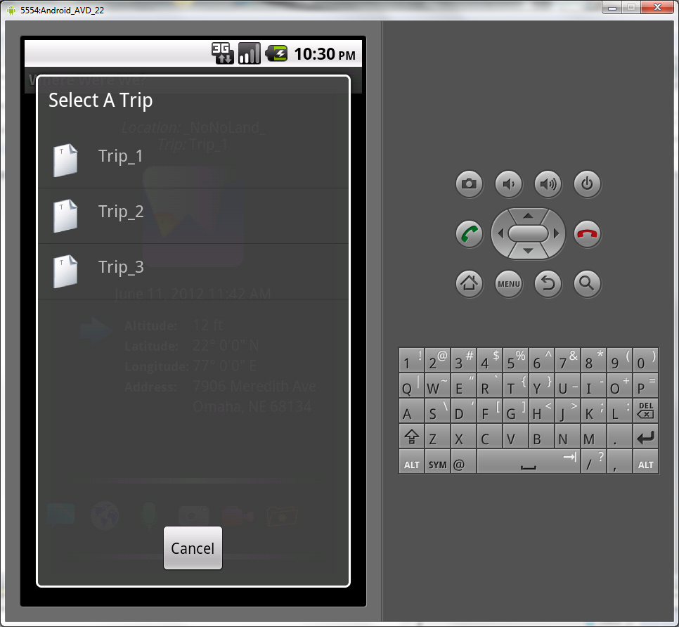

# Where Were We?
A mobile Android app to catalog where you've been. Map and store waypoints along with pictures and videos.

## Notes from Jon
* This is a ten-year-old Android project of mine I thought was lost, but I just found buried on an old hard drive. I'm uploading it here because it worked really well 3 phones ago (a Motorola Droid, I think), and maybe it will inspire me to update it to see if I can get it working on the Pixel 7 Pro.

* Google Maps does a lot of this functionality now, so it may not be worth spending a lot of time on. But keep in mind back in 2011 it was pretty cool stuff. -jjs

## Screens

### Main

This is the main screen. The status bar at the bottoms allows the other functions - Notes, Map View, Audio Notes, Camera, Video Notes, and Options.

### Options Menu

### Trip Options

### Trips

### Locations

